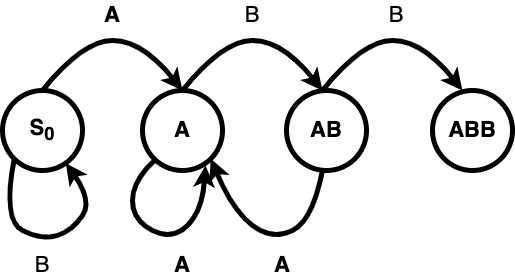

# Úloha SK-L

Odkaz na úlohu nájdeš tu: https://zenit.ksp.sk/task/zenit24skl

Celé znenie zadania nájdeš na konci tohto `README`

# Riešenie

Ďakujem štvrtákom za názov algoritmu. Na riešenie tohto problému je potrebné použiť tzv.
Markov chain, teda Markovov reťazec. Jedná sa o riešenie takzvaného stavového diagramu, kde
nás zaujíma konkrétne absorpcia markovovej reťaze. Najprv som trochu konzultoval s GPT, ale
to viedlo úplne do stratena.

Markovov reťazec sa dá pre požadovaný text ABB v dvojpísmenkovej abecede zakresliť nasledovne:



Požadovaný stav je stav  $`ABB`$, začíname zo stavu $`S_0`$. Z každého stavu sa vieme dostať
do iného po šípke, ktorá má v našom prípade vždy pravdepodobnosť $`0.5`$. Skús sám nasledovať
šípky ak je vstupný text $`BABAABAAB`$ v ktorom stave skončíš?

Takýto diagram vieme v kóde zapísať dvoma spôsobmi
1. [Adjacency List](https://en.wikipedia.org/wiki/Adjacency_list) (zoznam susedov) a
2. [Adjacency Matrix](https://en.wikipedia.org/wiki/Adjacency_matrix) (matica susedov)

Zoznam susedov je takmer nepoužiteľný. Ale matica susedov (pravdepodobností) by pre tento diagram vyzerala nasledovne:

$`P = \begin{bmatrix}
0.5 & 0.5 & 0 & 0 \\
0 & 0.5 & 0.5 & 0 \\
0 & 0.5 & 0 & 0.5 \\
0 & 0 & 0 & 1
\end{bmatrix}`$

- Teda zo stavu $`S_0`$ sa vieme dostať do $`S_0`$ s pravdepodobnosťou $`0.5`$ a do $`A`$ tiež.
- Zo stavu $`A`$ do stavu $`A`$ a do stavu $`AB`$ s pravdepodobnosťou $`0.5`$
- Zo stavu $`AB`$ do stavu $`A`$ a do stavu $`ABB`$ s pravdepodobnosťou $`0.5`$
- Stav $`ABB`$ je finálny, takže žiaden ďalší symbol už nemá vplyv na riešenie, preto pravdepodobnosť 1 smerujúca do $`ABB`$

Ak si prečítaš materiály nižšie, zistíš, že pre výpočet absorpčného reťazca $`N`$ použijeme vzorec

$`N = (I - Q)^{-1}`$

Kde $`Q`$ je zjednodušene matica susedov bez posledného riadku a stĺpca a $`I`$ je
[Identity matica](https://en.wikipedia.org/wiki/Identity_matrix), teda matica, ktorá má po hlavnej diagonále
len jednotky, na ostatných miestach nuly. Posledným krokom bude inverzia matice, čo je už náročná úloha.
Našťastie existujú kódy, použitelné pomocou copy paste.

Ako vytvoriť maticu pravdepodobností tu uvádzať už nebudem.

Moje riešenie dáva `WA` pravdepodobne kvôli zaokrúhľovaniu. Strávil som s tým asi 2 hodiny, tento problém sa
mi ale nepodarilo vyriešiť. Skúsil by som skôr Python.

Uvádzam nejaké materiály:
1. Čo je Markovov reťazec - [Wikipedia (CZ)](https://cs.wikipedia.org/wiki/Markov%C5%AFv_%C5%99et%C4%9Bzec)
2. Výpočet pre absorpčný reťazec - [tá istá stránka](https://cs.wikipedia.org/wiki/Markov%C5%AFv_%C5%99et%C4%9Bzec#Fundament%C3%A1ln%C3%AD_matice_absorp%C4%8Dn%C3%ADho_%C5%99et%C4%9Bzce)
3. Podrobnejší návod pre absorpciu - [Wikipedia (EN)](https://en.wikipedia.org/wiki/Absorbing_Markov_chain#:~:text=In%20the%20mathematical%20theory%20of,once%20entered%2C%20cannot%20be%20left.)
4. [Inverzia matice 1](https://stackoverflow.com/questions/60300482/c-calculating-the-inverse-of-a-matrix) (pomalý výpočet diskrimimantu)
5. [Rýchlejší výpočet diskriminantu](https://www.geeksforgeeks.org/cpp-program-for-determinant-of-a-matrix/)
6. [Inverzia matice 2](https://cplusplus.com/forum/beginner/276798/) - ukázala sa najrýchlejšia

# Zadanie

## Leremiáš a Miško
_Počet bodov: 90_

_Táto úloha je rovnaká ako úloha zenit23ck2j_

Raz sa malý Miško zúčastnil slovného hádania so svojimi kamarátmi. Všetci sedeli okolo stola a snažili sa uhádnuť tajné
heslo. Keď prišla Miškova poradová chvíla, bol nervózny (pochopiteľne). No namiesto toho, aby povedal nejaké slovo,
začal koktať a vypúšťať nahodilé hlásky.

_“Kááá… ééeeé… ešte… mmmm… ťťť…,”_ koktal Miško beznádejne.

_“Kemť?”_ opýtal sa neveriacky Leremiáš. Všetci sa zasmiali a za bruchá pochytali, pretože kemť nebolo ani zďaleka
správne heslo. No Miško sa nevzdal a pokračoval v hádaní nahodilých písmen.

_“Možno by bolo lepšie, keby si len hádal slová, Miško,”_ povedal mu jeden z kamarátov s úsmevom. _“Tvoja mama,”_
odpovedal Miško s úsmevom a pokračoval v hádaní.

## Úloha
Miško postupne hovorí nahodilé písmená z abecedy až kým súvisle nevysloví celé heslo. Miško vyslovuje písmená nezávisle
a rovnomerne náhodne. Aký je očakávaný počet písmen, ktoré Miško vysloví, kým sa mu konečne podarí vysloviť celé heslo?

## Vstup a Výstup
Prvý riadok vstupu obsahuje číslo $`A`$, ktoré označuje veľkosť abecedy, z ktorej Miško vyslovuje písmená.

Na druhom riadku je heslo $`H`$, pozostávajúce iba z prvých $`A`$ malých písmen anglickej abecedy.

Vypíšte jedno desatinné číslo, ktoré označuje očakávaný počet vyslovených písmen, ktoré Miško vysloví, kým nepovie
súvisle heslo $`H`$ .

Keďže počet písmen môže byť veľmi veľký, vypíšte ho modulo $`10^9 + 7`$ (teda celočíselnú časť zmodulujte a desatinnú
nechajte tak). Odpovede sú považované za správne, ak je ich absolútna alebo relatívna chyba nanajvýš $`10^-6`$.

### Príklad

Input:
```
2
aaa
```

Output:

```
14.0
```

Input:
```
2
abb
```

Output:

```
8.0
```

Input:
```
3
abbc
```

Output:

```
81.0

```